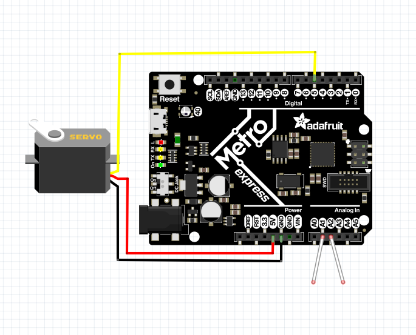
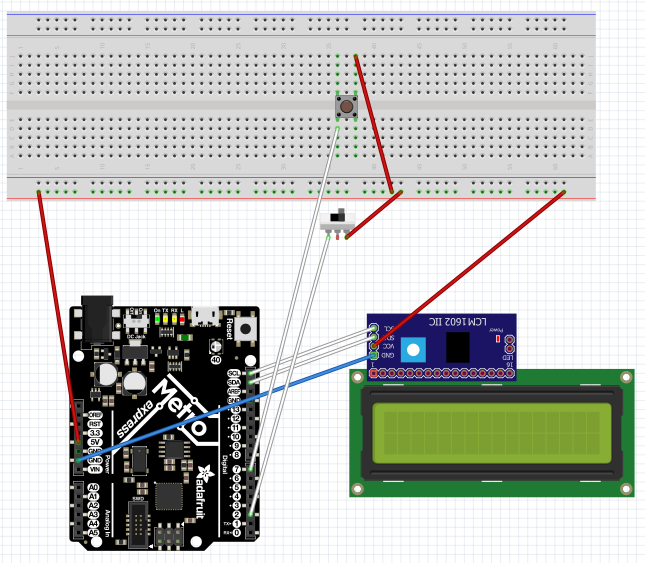
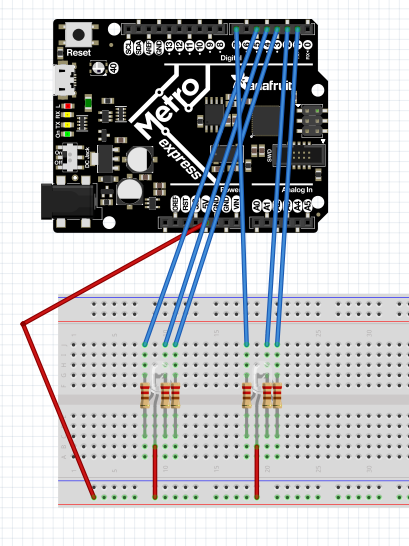
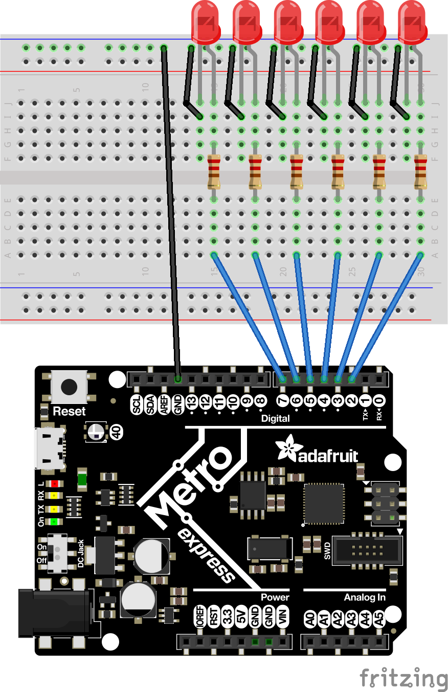

# These users helped me with syntax and images. 

[Rowan Miller](https://github.com/rmiller85)

[Philip Breen](https://github.com/pbreen40)

[Adafruit CircuitPython Guide](https://learn.adafruit.com/welcome-to-circuitpython/overview)

# My CircuitPython assignments

## LEDFade:
### Objective
Make a LED fade from full brightness to off. I started by wiring an LED in the same fashion as with an Arduino. I then looked at my old blink codee and modified it using Adafruits guide. 
### Picture:


This image is from the [Arduino Blink Guide](https://www.arduino.cc/en/tutorial/blink) but works here as the boards are the same in terms of led wiring. All you have is a 220 ohm resistor going into power and the longer leg of the LED. The shorter leg is ground. 

### Reflection
`LEDFade.py`
``` python
    
while True: #essesialy a void loop
    for I in range(0, 65535, 1): #counts from 0 to 65535 and then writes it to the LED
        analog_out.value = i
    for j in range(65535, 0, -1): #counts from 65535 down to 0 and then writes it to the LED
        analog_out.value = j
```
Our variable counts up, but once it reaches 6000, it multiplies it by a negative and it counts down until it reaches 2000, where it begins to count up. I learned how to use the new board as well as a fist step into Circuit Python. I completed the assignment by using my arduino experince and translating it to Circuit Python. 

## Circuit Python Servo:
### Objective
Use capacitive touch to move a servo back and forth. I started by wiring a servo and two capacitive touch leads(normal wires). I then used adafruits CircuitPython guide to set up the main functionality. I initially tried to use lower level solution to the servo spin but eventually switched to higher level. 
### Picture


This image is a wiring diagram by [Philip Breen](https://www.github.com/pbreen40)
and shows the servo wiring as well as the capacitive touch leads. The servo is Black/Brown -> Ground, Red -> 5v, and Yellow/White -> Signal. The leads can be put in any analog pins. 

### Reflection
`Servo.py`
``` python
    
def servo_duty_cycle(pulse_ms, frequency=50):
    period_ms = 1.0 / frequency * 1000.0
    duty_cycle = int(pulse_ms / (period_ms / 65535.0))
    return duty_cycle
```
PWM works by sending lots of signals at a certain frequency and certain intervals. I primarily used this guide (https://bit.ly/2rvsclJ) to help me work it all out. There was lots of collaboration on this assignment amoung us. The wiring is RED-5V, BLACK-GND, YELLOW-DPIN. I would recommend getting your servo working before using the capacitive touch. I used this (https://bit.ly/2X8vuXP) guide to learn how to use capacitive touch. It was a lot easier than the PWM for me. The overall takeaway was learning how to PWM as well a finding some good Circuit Python rescorces. 

## LCD:
### Objective
Count the number of times a button has been pressed on an LCD. I started by wiring up an LCD backpack which was easier thanks to the included SDA and SCL pins. I then used the intructions on the library to get it working. 
#### Picture:


This image is a wiring diagram by [Philip Breen](https://github.com/pbreen40)
and shows the LCD backpack wiring along with button and switch wiring. The male pins connect to their labbled pins on the board, one of the pros of the Metro Express is the inbuilt SDA and SCL pins. 
 
### Reflection
`ButtonLCD.py`
``` python
    
LCD.set_cursor_pos(0, 1)
LCD.print("ButtonPress:")
while True:
    if switch.value:
        LCD.set_cursor_pos(0, 14)
    else:
        LCD.set_cursor_pos(0, 14)
        value = value + 1
        LCD.print(str(value))
        time.sleep(0.3)
```
The first challenge on this assignment was to get the LCD to work, we used the documentation on the library as well as an LCD backpack to get it running. Once we did that we got to work on getting the button wired up and coded. After that, all we had to do was code out logic. One hard part was getting the variables to work with each other and the LCD. I think the solution we found works well. One of the main benefits we found in the new boards is a built in SDA and SCL pin. We learned how to install libraries in the Metros. 

## Photo-interrupter:
### Objective
Output the number of times a photo-interrupter has been interrupted every 4 seconds without using sleep.  I started by wiring a photointerupter, it was much easier than last year because of the indicator LED. I did have some trouble with the adress for the LCD so just make sure to read the library documentation for that. 

### Reflection
`Photointterupter.py`
``` python
    
remaining = max + start - time.time() #calculates the time
    if remaining <= 0: #if time is over
        print("# of interrupts:", (value))
        max += 4 #sets the variables back to default
        value = 0
```
This was my code for the delay. I used a variable that would count down to allow us to do their delay. Then I would output the number of interrupts and restart the variables. The hardest part of the assignment was the delay because it was something new to us as opposed to the photo-interrupter we have used before. We learned alternatives to "time.sleep()." We also learned new logic structures like the "if and not"" statment"  

## Distance Sensor
### Objective
Light up the onboard RGB neopixel according to the distance measured. I started this assignment by messing around with the online RGB calculator to get a feel for how they work. I then used the Adafruit guide to light up the neopixel. Afteer that I just made different distances corespond to different RGB values. 

### Reflection
`DistanceSensor.py`
``` python
 if sonarValue < 5:
     dot.fill((255, 0, 0))
```
This is the core code of the assignment. dot.fill works by sending RGB values to the neopixel with a library. This example should light up the neopixel red when the distance is less than 5. One of the main takeaways for me was learning that an RGB LED is essensialy just three normal LEDs and a shared ground in terms of wiring and control. 
## Classes, Objects, and Modules:
### Objective
Write a library that makes the code provided work. I then just used the guide to figure out RGB LEDs(very similar to neopixel) and then wrote a simple library to make it work. 
### Picture


This image is a wiring diagram by [Philip Breen](https://github.com/pbreen40) and shows the wiring of RGB LEDS. The important thing to bear in mind is the orientation and best practice is to look up an image to make sure you got it right. 

### Reflection
`RGBLED.py`
``` python
def __init__(self, r, g, b):
     print(str(r))
     self.r = pulseio.PWMOut(r, frequency=5000, duty_cycle=0)
     self.g = pulseio.PWMOut(g, frequency=5000, duty_cycle=0)
     self.b = pulseio.PWMOut(b, frequency=5000, duty_cycle=0)
```
This is the core code of the assignment. Here we are assigning duty cycles to the different variables so we can easily code the colors. This assignment took a long time but we also learned a lot about how to make a lib. The code is pretty simple if you can grasp how a library works. This assignment really helped me because before I thought libraries were intimidating things only made by pros with lots of time on their hands but now they are just intimidating things that anyone can make as they are just a text file if you are using Circuit Python. 
## Hello VS Code:
### Objective
Learn how to use VS Code. 
### Reflection
This was really a very simple assignment. I would just recommend reading the instructions for the git parts very closely. I also liked doing all the code by myself, it was nice to do it without help and made me feel like I was closer to being able to use CircuitPython proficiantly.
## Fancy LED:
### Objective
Write a library that can make LEDs act in a certain fashion. This code was just heavily modified code from Classees, Objects, and Modules.
### Picture:


This image is a wiring diagram by [Philip Breen](https://github.com/pbreen40). All you have is a 220 ohm resistor going into power and the longer leg of the LED. The shorter leg is ground. 

### Reflection
`Lib.py`
``` python
  def alternate(self):
        print("alternate") #runs alternate function
        self.fancy1.value = True
        self.fancy2.value = False
        self.fancy3.value = True
        time.sleep(.15)
        self.fancy1.value = False
        self.fancy2.value = True
        self.fancy3.value = False
        time.sleep(.15)

```
This is essentially the same as the RGB LED assignment except for multiple mono-color LEDs. I just took the old code and modified it for this. I figures out how to modify my existing library to complete the same assignment as they are very similar in their core function.
