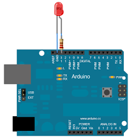
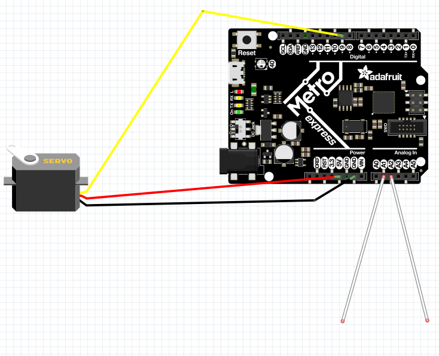

# CircuitPython
## My CircuitPython assignments

### LEDFade:
#### Objective
Make a LED fade from full brightness (255) to off (0).
#### Picture:



#### Lessons
In this assignment, we learned how to use the new metro express board as well as CircuitPython using Mu. Circuit python is just Arduino but simpler and more reliant on spacing. 
#### Important Code
`LEDFade.py`
``` python
    
while True: #essesialy a void loop
    for I in range(0, 65535, 1): #counts from 0 to 65535 and then writes it to the LED
        analog_out.value = i
    for j in range(65535, 0, -1): #counts from 65535 down to 0 and then writes it to the LED
        analog_out.value = j
```
Our variable counts up, but once it reaches 6000, it multiplies it by a negative and it counts down until it reaches 2000, where it begins to count up. 

### Circuit Python Servo:
#### Objective
Use capacitive touch to move a servo back and forth.
#### Picture



#### Lessons
Learned how to use PWM(pulse width modulation) as well as capacitive touch on the Metro Express. PWM can be hard the first time and looking things up helps a lot. Talk to people who have already done what you are trying to do. 
#### Important Code
`Servo.py`
``` python
    
def servo_duty_cycle(pulse_ms, frequency=50):
    period_ms = 1.0 / frequency * 1000.0
    duty_cycle = int(pulse_ms / (period_ms / 65535.0))
    return duty_cycle
```
PWM works by sending lots of signals at a certain frequency and certain intervals. I primarily used this guide (https://bit.ly/2rvsclJ) to help me work it all out. There was lots of collaboration on this assignment amoung us. The wiring is RED-5V, BLACK-GND, YELLOW-DPIN. I would recommend getting your servo working before using the capacitive touch. I used this (https://bit.ly/2X8vuXP) guide to learn how to use capacitive touch. It was a lot easier than the PWM for me. 

### LCD:
#### Objective
Count the number of times a button has been pressed on an LCD.
#### Lessons
How to use an LCD with the Metro Express as well as how to use a button. I learned about more kinds of variables and how to use them. 
#### Important Code
`ButtonLCD.py`
``` python
    
LCD.set_cursor_pos(0, 1)
LCD.print("ButtonPress:")
while True:
    if switch.value:
        LCD.set_cursor_pos(0, 14)
    else:
        LCD.set_cursor_pos(0, 14)
        value = value + 1
        LCD.print(str(value))
        time.sleep(0.3)
```
The first challenge on this assignment was to get the LCD to work, we used the documentation on the library as well as an LCD backpack to get it running. Once we did that we got to work on getting the button wired up and coded. After that, all we had to do was code out logic. One hard part was getting the variables to work with each other and the LCD. I think the solution we found works well.

### Photo-interrupter:
#### Objective
Output the number of times a photo-interrupter has been interrupted every 4 seconds without using sleep.  
#### Lessons
I learned how to use some new logic as well as time sleep alternatives. This was my first time using an "If and not" statement. 
#### Important Code
`Photointterupter.py`
``` python
    
remaining = max + start - time.time() #calculates the time
    if remaining <= 0: #if time is over
        print("# of interrupts:", (value))
        max += 4 #sets the variables back to default
        value = 0
```
This was my code for the delay. I used a variable that would count down to allow us to do their delay. Then I would output the number of interrupts and restart the variables. The hardest part of the assignment was the delay because it was something new to us as opposed to the photo-interrupter we have used before. 
#### Objective
Light up the onboard RGB neopixel according to the distance measured. 
#### Lessons
We figured out how to use a distance sensor with CircuitPython. We also learned how to use RGB with LEDs. 
#### Important Code
`DistanceSensor.py`
``` python
 if sonarValue < 5:
	 dot.fill((255, 0, 0))
```
This is the core code of the assignment. dot.fill works by sending RGB values to the neopixel with a library. This example should light up the neopixel red when the distance is less than 5. 
### Classes, Objects, and Modules:
#### Objective
Write a library that makes the code provided work. 
#### Lessons
I learned how libraries work and how they are really just files of code. I learned how to make two files interact with one another. 
#### Important Code
`RGBLED.py`
``` python
def __init__(self, r, g, b):
	 print(str(r))
	 self.r = pulseio.PWMOut(r, frequency=5000, duty_cycle=0)
	 self.g = pulseio.PWMOut(g, frequency=5000, duty_cycle=0)
	 self.b = pulseio.PWMOut(b, frequency=5000, duty_cycle=0)
```
This is the core code of the assignment. Here we are assigning duty clcleys to the different variables so we can easily code the colors. This assignment took a long time but we also learned alot about how to make a lib. The code is pretty simple if you can grasp how a library works. 
### Hello VS Code:
#### Objective
Learn how to use VS Code. 
#### Lessons
This was really a very simple assignment. I would just recommend reading the instructions for the git parts very closely. I also liked doing all the code by myself, it was nice to do it without help and made me feel like I was closer to being able to use CircuitPython.
### Fancy LED:
#### Objective
Write a library that can make LEDs act in a certain fashion. 
#### Lessons
Learned how to use libraries in conjunction with VS code. Got better at modifying existing code. I learned how to test one variable at a time to isolate problems. 
#### Important Code
`Lib.py`
``` python
  def alternate(self):
        print("alternate") #runs alternate function
        self.fancy1.value = True
        self.fancy2.value = False
        self.fancy3.value = True
        time.sleep(.15)
        self.fancy1.value = False
        self.fancy2.value = True
        self.fancy3.value = False
        time.sleep(.15)

```
This is essentially the same as the RGB LED assignment except for multiple mono-color LEDs. I just took the old code and modified it for this. 


